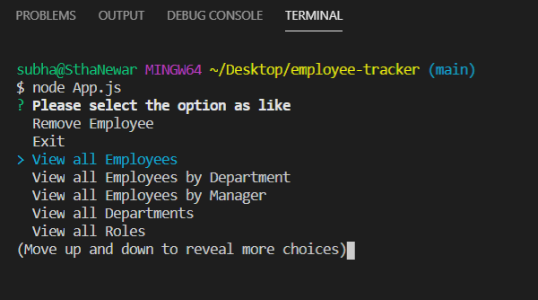
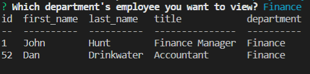
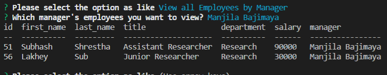
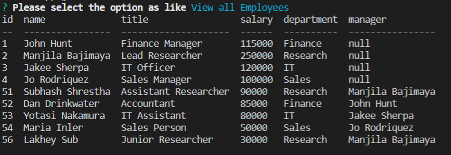

  # Title
  ## Employee Tracker
  
  
  
  ## Table of contents 
  - [Description](#description)
  - [Installation](#installation)
  - [Usage Information](#usage-information)
  - [License](#license)
  - [Contribution Guidelines](#contribution-guidelines)
  - [Test Procedure](#test-procedure)
  - [Screenshot](#screenshot)
  - [Questions](#questions)
  
  ## Description
     Th application which saves the information about employee professional information such as what's the salary of employee, who is the manager of employee, which department does employee works. This application allows to view information of employee, remove employee information, also provides functionality of edit as well. All data is stored into database and database port, username, password, database name, host name can be updated in the .env file and this makes user able to change database information without accesing the program files. Both scheme and seed sql files is provided for testing and verifiaction of application functionalities.   

  ## Installation
     first need to clone from given github link and need to perform 'npm i' on terminal within the project location. Finally, the application will ready to run.

  ## Usage Information
     It is useful to store employee information and helps for verification of employee designation, salary, manager, and department. 

  ## License
     MIT license
  
  ## Contribution Guidelines
     N/A

  ## Test Procedure
     N/A
  
  ## Screenshot
  ### Startup Screen
  
  ### Department 
  
  ### Employee by Manager 
  
  ### All Employee
  
  
  ## Questions
    if you have questions then please feel free to contact on these addresses,
  Github: [SthaSub](https://github.com/SthaSub)
  
  Email: [subhashshrestha3@gmail.com](subhashshrestha3@gmail.com)
    